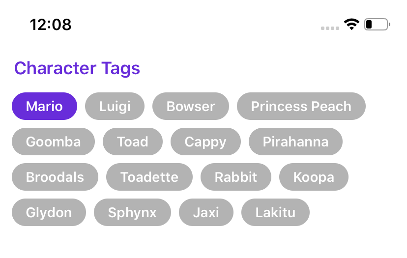

Xam.iOS.UIHelpers
=============================================================


Build your `Xamarin.iOS` UI the easy and clean way in **C#**.

Inspired by **LBTA Tools** by [*Brian Voong*](https://github.com/bhlvoong/LBTATools).

## Install

Find `PDCo.Xamarin.iOS.UIHelpers` on **NuGet** package manager.

## Usage

-----

### **On this page:**

* [Stacking with UIStackView](#1.-stacking-with-uistackview)
* [Auto Layout](#2.-auto-layout)
* [Creating UI Elements](#3.-creating-ui-elements)
* [Left Justify Cells in a UICollectionView](#4.-left-justify-cells-in-a-uicollectionview)


-----


### 1. Stacking with UIStackView

***Basic Example***

```c#
// Traditional way...

var stackView = new UIStackView(new[] {ImageView, Label}) 
{
    Axis = UILayoutConstraintAxis.Vertical
};
```

```c#
// UIHelpers way...

var stackView = UI.VStack(ImageView, Label);
```

***Advanced Example***

```c#
// Traditional way...

var innerStackView = new UIStackView(new[] {TitleLabel, SubTitleLabel})
{
   Axis = UILayoutConstraintAxis.Vertical,
   Spacing = 3
};

var outerStackView = new UIStackView(new[] {ImageView, innerStackView})
{
   Axis = UILayoutConstraintAxis.Horizontal,
   Alignment = UIStackViewAlignment.Center,
   Spacing = 6
};
```

```c#
// UIHelpers way...

var stackView = UI.HStack(
   ImageView,
   UI.VStack(
       TitleLabel,
       SubTitleLabel
   ).Spacing(3)
).Alignment(UIStackViewAlignment.Center)
 .Spacing(6);
```

### 2. Auto Layout

***Basic Example***

```c#
// Traditional way...

// Anchor subview's leading, top, trailing and bottom constraints to superviews, respectively.

view.AddSubView(someView)

someView.TranslatesAutoresizingMaskIntoConstraints = false;
someView.LeadingAnchor.ConstraintEqualTo(view.LeadingAnchor).Active = true;
someView.TopAnchor.ConstraintEqualTo(view.TopAnchor).Active = true;
someView.TrailingAnchor.ConstraintEqualTo(view.TrailingAnchor).Active = true;
someView.BottomAnchor.ConstraintEqualTo(view.BottomAnchor).Active = true;
```

```c#
// UIHelpers way...

view.AddSubview(someView);

someView.AnchorFill();
```

```c#
// If you need a referenced to the constraints applied...

var anchoredConstraints = new AnchoredConstraints();

view.AddSubview(someView);

someView.AnchorFill(constraints: anchoredConstraints);
```

### 3. Creating UI Elements

Reduce the number of lines when creating UI elements.

```c#
// Traditional way...

var titleLabel = new UILabel {
   Text = "SomeText",
   TextColor = UIColor.Black,
   TextAlignment = UITextAlignment.Left,
   Font = UIFont.SystemFontOfSize(12),
   Lines = 0
};
```

```c#
// UIHelpers way...

var titleLabel = UICreateLabel("SomeText", UIColor.Black, UIFont.SystemFontOfSize(12));
```

### 4. Left Justify Cells in a UICollectionView

Works for self-sizing and fixed cells.  
See full working code in *Examples* folder.

```c#
var flowLayout = new LeftAlignCollectionViewFlowLayout();
var collectionViewController = new UICollectionViewController(flowLayout);
```



## License

Xam.iOS.UIHelpers is available under the MIT license.
